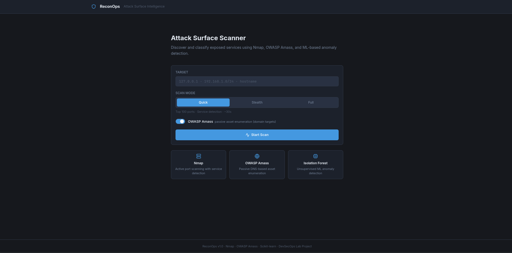
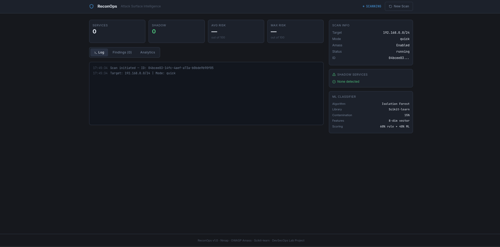
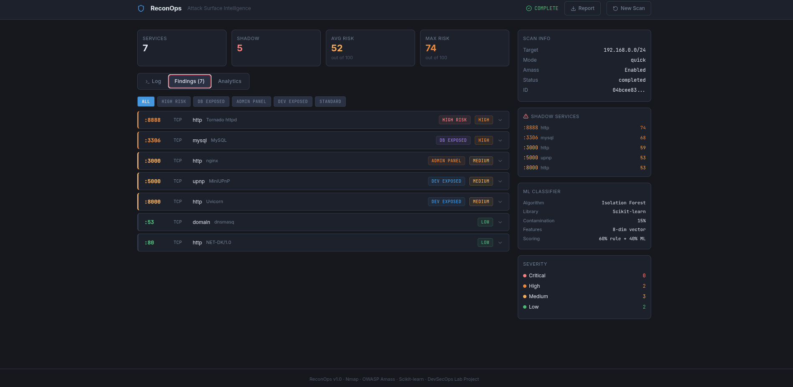
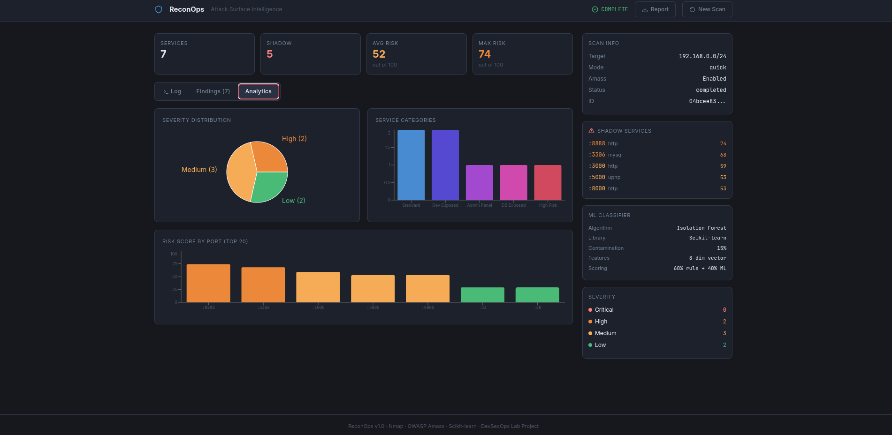

# ReconOps

**Infrastructure visibility and attack surface intelligence for DevSecOps workflows.**

ReconOps is a containerized platform that continuously discovers exposed network services, classifies them using a hybrid ML and rule-based engine, and delivers real-time findings to an operational dashboard. Built as a DevSecOps lab project, it reflects how modern security teams approach infrastructure visibility — automated discovery, anomaly detection, and structured reporting, integrated into a standard engineering workflow.

---


---

## Dashboard

| Scan Configuration | Live Results |
|---|---|
|  |  |

| Findings Analysis | Risk Analytics |
|---|---|
|  |  |

---

## Why ReconOps?

In most infrastructure environments, there is a gap between what is *supposed* to be running and what is *actually* running. Development services get left exposed after a sprint. Database ports are opened for debugging and never closed. Legacy services run unnoticed on internal segments.

This class of exposure — often called shadow services — is consistently one of the most common findings in internal security assessments, and it is almost entirely preventable with automated visibility tooling.

ReconOps addresses that gap by:

- **Automating discovery** across IP ranges and subnets using Nmap
- **Classifying findings** with a transparent, explainable risk model
- **Surfacing anomalies** that don't match expected infrastructure patterns
- **Delivering results** in real time through a structured operational interface
- **Fitting into existing workflows** via Docker Compose, CI/CD, and Prometheus

The goal is not penetration testing. It is infrastructure awareness — knowing what is running, where, and whether it belongs there.

---

## Features

### Scanning
- Active port and service discovery via Nmap (`-sV` service version detection)
- Passive asset and subdomain enumeration via OWASP Amass
- Three scan profiles:
  - Quick (top 100 ports)
  - Stealth (SYN scan, low noise)
  - Full (all 65535 ports)

### Classification
- Hybrid risk scoring: 60% heuristic rules + 40% ML anomaly signal
- Isolation Forest anomaly detection trained on each scan's own baseline
- Seven service categories:
  - `high_risk`
  - `db_exposed`
  - `admin_panel`
  - `legacy`
  - `iot`
  - `dev_exposed`
  - `standard`
- Plain-language finding descriptions for each detected service

### Operations
- Real-time WebSocket feed — findings appear as they are discovered
- Structured Markdown report export per scan
- Prometheus metrics endpoint for observability integration
- Scan history within session (in-memory)

### Engineering
- Single-command deployment via Docker Compose
- Multi-stage frontend build (Vite → nginx)
- GitHub Actions CI: static analysis, type checking, container scanning
- Structured logging with `structlog`
- Environment-based configuration via `.env`

---

## Architecture

```text
┌─────────────────────────────────────────────────────────────────┐
│                        ReconOps Platform                        │
│                                                                 │
│  ┌───────────────────────────────────────────────────────────┐  │
│  │                    React Dashboard                        │  │
│  │            (Vite · TypeScript · Recharts)                 │  │
│  └───────────────────────┬───────────────────────────────────┘  │
│                          │ REST + WebSocket                     │
│  ┌───────────────────────▼───────────────────────────────────┐  │
│  │                   FastAPI Backend                         │  │
│  │      (async · Pydantic v2 · structlog · Prometheus)       │  │
│  └────────┬─────────────────────────┬────────────────────────┘  │
│           │                         │                           │
│  ┌────────▼─────────┐    ┌──────────▼──────────┐                │
│  │  Scanner Service │    │   ML Classifier     │                │
│  │                  │    │                     │                │
│  │  Nmap ─────────► │    │ Feature extraction  │                │
│  │  python-nmap     │    │ Isolation Forest    │                │
│  │                  │    │ Heuristic rules     │                │
│  │  OWASP Amass ──► │    │ Composite scoring   │                │
│  │  passive DNS     │    │                     │                │
│  └──────────────────┘    └─────────────────────┘                │
│                                                                 │
│  ┌───────────────────────────────────────────────────────────┐  │
│  │ Observability: Prometheus /metrics · structlog JSON       │  │
│  └───────────────────────────────────────────────────────────┘  │
└─────────────────────────────────────────────────────────────────┘
```

Deployment: Docker Compose (backend + frontend + optional monitoring stack)  
CI/CD: GitHub Actions → Bandit → TypeScript → Docker build → Trivy

---

## ML Design

### Why Isolation Forest?

Most ML-based security tools require labeled training data. For infrastructure scanning, that data does not exist in a generalized form. Every environment is different, and what counts as “normal” depends entirely on the specific network being scanned.

Isolation Forest is an unsupervised anomaly detection algorithm. It requires no labeled dataset. Instead, it learns the statistical baseline from the scan itself, then scores each service by how different it is from that baseline.

This makes it appropriate for this problem because the model is self-calibrating per scan, requires no pre-training, and runs efficiently.

### Feature Engineering

| Feature | Description | Signal |
|---|---|---|
| `port_normalized` | Port number / 65535 | Continuous scale position |
| `is_privileged` | Port < 1024 | System-level service indicator |
| `is_ephemeral` | Port > 49151 | Dynamic range flag |
| `is_well_known` | Standard service ports | Known safe service |
| `is_open` | Binary state | Exposure confirmation |
| `service_len_norm` | Service name length / 20 | Specificity proxy |
| `is_db_range` | Database port membership | Database exposure |
| `is_high_nonstandard` | >1024 and not standard | Shadow service signal |

### Hybrid Scoring

```text
risk_score = (heuristic_score × 0.60) + (ml_anomaly_score × 0.40)
```

The heuristic layer handles known-bad signatures where domain knowledge is stronger than statistics. The ML layer handles generalized anomaly detection.

---

## Quick Start

### Requirements

- Docker
- Docker Compose

### Run

```bash
git clone https://github.com/r0s3mrcx/reconops.git
cd reconops
docker-compose up --build
```

Frontend: `http://localhost:3000`  
Backend API: `http://localhost:8000`  
Swagger UI: `http://localhost:8000/docs`

---

## Local Development

### Backend

```bash
cd backend
python -m venv venv
source venv/bin/activate
pip install -r requirements.txt
uvicorn app.main:app --reload --port 8000
```

Install Nmap on Arch Linux:

```bash
sudo pacman -S nmap
```

### Frontend

```bash
cd frontend
npm install
npm run dev
```

---

## API Reference

| Method | Endpoint | Description |
|---|---|---|
| GET | `/health` | Health check |
| POST | `/api/scans` | Start a scan |
| GET | `/api/scans/{id}` | Get scan results |
| GET | `/api/scans/{id}/report` | Download report |
| WS | `/api/scans/{id}/ws` | Real-time event feed |
| GET | `/metrics` | Prometheus metrics |
| GET | `/docs` | Swagger UI |

---

## Observability

```bash
docker-compose --profile monitoring up --build
```

- Prometheus → `http://localhost:9090`
- Grafana → `http://localhost:3001`

---

## Deployment

### Frontend → Vercel

Deploy the React frontend as a static application.

### Backend → Render

Deploy FastAPI backend as a web service.

Important:
- Restrict targets using allowlists
- Do not expose unrestricted scanning publicly

---

## Ethical Use

ReconOps is intended only for:
- Authorized infrastructure scanning
- Educational DevSecOps labs
- Internal visibility tooling
- CI/CD security validation

Never scan systems without explicit permission.

---

## Known Limitations

| Limitation | Resolution Path |
|---|---|
| In-memory storage only | Add PostgreSQL or Redis |
| No authentication | Add OAuth2 or API keys |
| No scheduling | Add APScheduler |
| Small scans reduce ML quality | Use larger subnet baselines |

---

## Future Improvements

- PostgreSQL persistence
- OAuth2 authentication
- Scheduled scans
- CVE correlation
- Slack/Webhook alerts
- Scan diffing
- Historical analytics

---

## About

ReconOps was built for:

**Autonomous Attack Surface Reduction**

> “Propose: Continuous AI discovery to identify shadow services. Implement: Use Nmap; integrate OWASP Amass for ML-based asset identification.”

**Tech stack:** FastAPI · React · Scikit-learn · Docker Compose · GitHub Actions · Prometheus · Nmap · OWASP Amass
